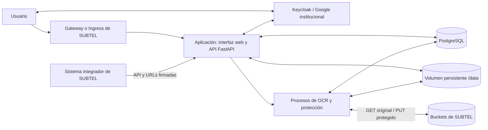

# Plataforma de Protección de Datos — SUBTEL

Aplicación para detectar, revisar y proteger datos personales en documentos, desplegable en la infraestructura de SUBTEL. Incluye interfaz web, API REST, PostgreSQL y procesamiento masivo de archivos almacenados en buckets. Versión de aplicación: **0.6.0**.

## Guía de lectura para el equipo técnico

| Necesidad | Documento |
|---|---|
| Comprender componentes, flujos y almacenamiento | [Arquitectura](docs/ARQUITECTURA.md) |
| Construir la imagen y desplegar en DEV y PROD | [Despliegue en Kubernetes](deploy/README.md) |
| Configurar PostgreSQL, recursos y credenciales | [Configuración](docs/CONFIGURACION.md) |
| Integrar buckets, API y Keycloak | [Integraciones](docs/INTEGRACIONES.md) |
| Validar, operar, respaldar y actualizar | [Operación y pruebas](docs/OPERACION.md) |
| Configurar reglas complementarias privadas | [Reglas de detección](docs/REGLAS_DETECCION.md) |

## Arquitectura a primera vista



La interfaz, la API y los procesos de trabajo forman **una aplicación modular distribuida en una imagen Docker**. PostgreSQL, Keycloak, el gateway y los buckets son servicios externos administrados por SUBTEL. No se necesita un servicio Redis ni un proveedor externo de IA para procesar documentos. El OCR se ejecuta localmente con Tesseract.

Hay dos recorridos: el flujo interactivo conserva archivos en `/data` para la revisión humana; el flujo masivo toma originales de un bucket y devuelve las copias protegidas mediante URLs firmadas. [Ver los dos flujos completos](docs/ARQUITECTURA.md#flujos-de-documentos).

## Funciones

- Carga individual, múltiple y ZIP, con lotes y reportes.
- Detección de 15 categorías de datos personales, incluyendo nombres, RUT, correos, direcciones y firmas.
- Revisión de hallazgos: aceptar, rechazar y marcar información manualmente.
- Cinco tratamientos: tachado, anonimización, seudonimización y enmascaramiento total o parcial.
- Aprobación administrativa para el perfil Regular.
- Políticas por tipo de documento, usuarios, permisos y bitácora de auditoría.
- Integración Keycloak mediante OIDC, autenticación local y LDAP opcional.
- API para protección directa y trabajos masivos desde buckets.

| Entrada | Procesamiento |
|---|---|
| PDF nativo o escaneado | Lectura de texto/OCR; salida PDF/A-1b formada por imágenes |
| JPG, JPEG, PNG, TIF, TIFF | OCR y protección de píxeles |
| DOCX, DOC | Tratamiento del texto; DOC se convierte con LibreOffice |
| XLSX, XLS | Tratamiento de celdas; XLS se convierte con LibreOffice |
| TXT | Tratamiento del texto y salida UTF-8 |

La imagen Docker incluye Tesseract en español e inglés, Poppler y LibreOffice.

## Prueba local con Docker Compose

Esta opción permite comprobar el sistema antes de adaptarlo al clúster. Requiere Docker y Docker Compose.

```bash
git clone https://github.com/joseibietasepulveda/softrock-subtel.git
cd softrock-subtel
cp .env.example .env
```

Completar `POSTGRES_PASSWORD` y `ADMIN_PASSWORD` en `.env`. Usar para PostgreSQL un valor aleatorio alfanumérico o hexadecimal, por ejemplo uno generado con `openssl rand -hex 24`. La contraseña de administrador requiere al menos 10 caracteres, una mayúscula y un número. `REGULAR_PASSWORD` es opcional; si está vacía, no se crea esa cuenta inicial. No hay contraseñas incorporadas al producto.

```bash
docker compose up --build -d
curl --fail http://localhost:8000/api/health
```

Abrir `http://localhost:8000` e ingresar como `admin` con la contraseña configurada. La API documentada está en `/docs`. Compose guarda PostgreSQL y los documentos en volúmenes independientes. `docker compose down` conserva esos volúmenes; agregar `-v` los elimina.

Para ejecutar Python directamente, instalar las dependencias de sistema indicadas en el [Dockerfile](Dockerfile), usar Python 3.12, definir `DATABASE_URL` y `ADMIN_PASSWORD` en `.env`, y ejecutar `./run.sh`. La base debe existir; la aplicación crea su esquema al arrancar con los permisos descritos en [Configuración](docs/CONFIGURACION.md).

## Instalación en SUBTEL

1. Construir la imagen desde una versión identificada de este repositorio y subirla al registro de SUBTEL.
2. Preparar PostgreSQL, credenciales y volumen persistente independientes para DEV y PROD.
3. Adaptar y aplicar los [manifiestos de Kubernetes](deploy/README.md).
4. Configurar gateway/TLS, Keycloak y, para el flujo masivo, los hosts de buckets permitidos.
5. Ejecutar la [validación de instalación](docs/OPERACION.md#validación-de-instalación) en DEV antes de promover la misma imagen a PROD.

## Alcance del procesamiento

La detección combina reglas, vocabulario y OCR. Los hallazgos pueden requerir correcciones humanas, especialmente en firmas, nombres y escaneos de baja calidad. Una verificación automática favorable no sustituye la revisión documental.

En el flujo interactivo, un resultado con alertas se identifica como `protected_with_warnings` y se descarga con advertencia; el perfil Regular conserva su aprobación administrativa. En el flujo masivo, una verificación fallida impide subir la copia al bucket. El PDF generado no conserva una capa de texto buscable. Para documentos Office, revisar también comentarios, cambios controlados y objetos embebidos según el alcance explicado en [Arquitectura](docs/ARQUITECTURA.md#alcance-y-propiedades-del-motor).

## Contenido del repositorio

```text
backend/              API, autenticación, base, motor y procesos de trabajo
frontend/             Interfaz HTML, CSS y JavaScript
Dockerfile            Imagen de aplicación con OCR y conversión Office
docker-compose.yml    Instalación local con PostgreSQL
deploy/               Ejemplos de instalación en Kubernetes
docs/                 Arquitectura, configuración, integración y operación
tests/                Pruebas automatizadas y documentos ficticios
tools/                Generación de corpus sintético y pruebas de carga
```

Los archivos operativos, las credenciales y los perfiles con datos personales se mantienen fuera del repositorio. Las reglas complementarias específicas pueden cargarse desde un JSON privado; sin ese archivo se utiliza la detección general. Las pruebas incluyen valores ficticios que no se utilizan para crear cuentas en instalaciones normales.
