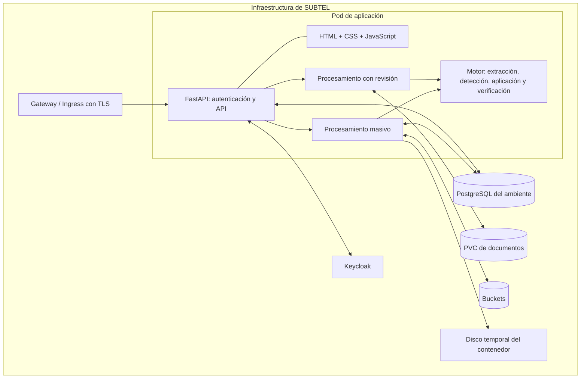
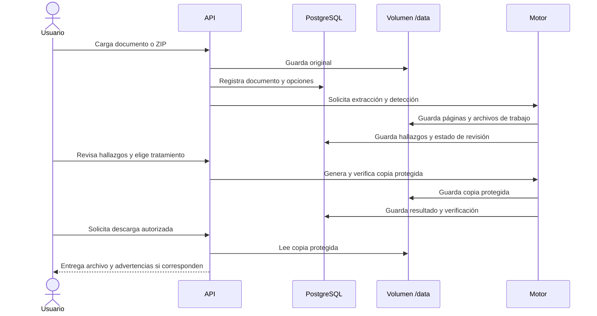
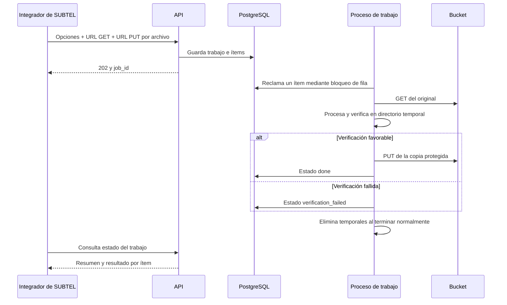

# Arquitectura de la plataforma

## Modelo de despliegue

La entrega contiene una aplicación modular Python/FastAPI y una interfaz web estática. Ambos se sirven desde el mismo proceso web, puerto 8000. El contenedor incorpora el motor de procesamiento y los hilos que ejecutan trabajos. Los módulos internos no son microservicios desplegados de forma independiente.

FSReader y FSWriter-API no forman parte del código de esta entrega. Si SUBTEL utiliza servicios con esos nombres, su integración puede hacerse desde el sistema que prepara las URLs firmadas y envía los trabajos a la API. La aplicación lee y escribe objetos mediante HTTP GET/PUT; no requiere desplegar un lector o escritor adicional propio.

## Componentes y código

| Componente | Implementación | Responsabilidad |
|---|---|---|
| API y autenticación | [`backend/app.py`](../backend/app.py) | Inicio, esquema PostgreSQL, sesiones, roles, Keycloak/LDAP, auditoría y protección directa |
| Documentos interactivos | [`backend/documents.py`](../backend/documents.py) | Carga, hallazgos, lotes, aprobación, descarga, recuperación y retención |
| Trabajos masivos | [`backend/jobs.py`](../backend/jobs.py) | Cola PostgreSQL, GET/PUT al bucket, reintentos y estado por documento |
| Motor por etapas | [`backend/pipeline.py`](../backend/pipeline.py) | Extracción, OCR complementario, detección, aplicación de tratamientos y verificación |
| Motor y formatos | [`backend/engine.py`](../backend/engine.py) | Reglas generales, conversión de formatos, OCR y protección directa |
| Reglas complementarias | [`backend/explicit_names.py`](../backend/explicit_names.py) | Coincidencias literales y correcciones OCR configuradas mediante un archivo JSON privado opcional |
| Interfaz | [`frontend/`](../frontend/) | Revisión visual, políticas, aprobaciones, usuarios y reportes |

## Flujos de documentos

### 1. Carga y revisión humana

El perfil Regular envía el documento a aprobación administrativa antes de poder descargar. La generación y el OCR se realizan en hilos de trabajo; el navegador consulta el progreso. Los metadatos y estados se guardan en PostgreSQL, mientras que los archivos quedan en el PVC.

Esta ruta no traslada automáticamente los documentos al bucket. Para integrarla con un gestor documental externo se utilizan sus endpoints de carga y descarga o el flujo masivo, según se requiera revisión humana.

### 2. Procesamiento masivo de bucket a bucket

El sistema integrador genera las URLs firmadas con permisos sobre los objetos. Debe dejar suficiente vigencia para la espera en cola, el procesamiento y los reintentos. La plataforma no almacena claves permanentes del proveedor de buckets.

La cola usa `FOR UPDATE SKIP LOCKED`. Un proceso toma el ítem con un plazo de reserva (`JOB_LEASE_SECONDS`). Si el plazo vence, otro puede retomarlo. Hay hasta tres intentos de procesamiento; errores HTTP 4xx son definitivos y errores de red/5xx permiten reintento. No hay garantía de ejecución exactamente una vez: un reinicio entre la escritura al bucket y la confirmación puede repetir el PUT. Conviene usar un destino estable por documento y permitir sobrescribir esa misma copia.

El plazo de reserva debe superar el tiempo máximo observado de procesamiento; no se renueva durante el trabajo. Si es demasiado corto, puede haber procesamiento simultáneo del mismo ítem.

Los fallos masivos se consultan por API. No generan automáticamente un documento en la bandeja de revisión humana; el integrador puede cargar después el original por la ruta interactiva.

## Almacenamiento y persistencia

| Ubicación | Contenido | Consideración operativa |
|---|---|---|
| PostgreSQL | Usuarios, sesiones, hashes de contraseñas/tokens API, políticas, lotes, documentos, hallazgos, estados, auditoría, seudónimos y cola masiva | Los hallazgos pueden contener texto personal extraído; requiere control de acceso y respaldo |
| `/data/docs/<id>/` | Original, copia protegida, extracción y páginas de trabajo del flujo interactivo | Montar un volumen persistente; respaldarlo junto con PostgreSQL |
| `/data/tmp/` | Archivos temporales de la ruta interactiva/directa | La aplicación limpia temporales antiguos |
| Temporal del sistema (`/tmp` por defecto) | Descarga, trabajo y resultado del flujo masivo | Se elimina al finalizar el ítem; un cierre abrupto puede dejar restos hasta la limpieza del contenedor |
| Buckets | Original y objeto de salida elegido por el integrador | SUBTEL controla permisos, ciclo de vida y versionado |

Los documentos completos no se guardan como archivos binarios en PostgreSQL. Sí se guardan allí datos personales derivados de su análisis y las URLs firmadas mientras el ítem está activo. Al cerrarlo se eliminan sus URLs; las cabeceras `target_headers` quedan almacenadas, por lo que deben contener solo datos de formato y no credenciales permanentes.

La retención automática se aplica a originales y protegidos según su estado y fecha de protección. No equivale a una política completa de eliminación de datos de PostgreSQL ni borra todos los documentos sin completar. [Ver operación](OPERACION.md).

## Concurrencia y escalamiento

- `WEB_WORKERS`: procesos web dentro del contenedor.
- `PROCESSING_WORKERS`: hilos de procesamiento interactivo por proceso web.
- `JOB_WORKERS`: hilos masivos por proceso web.

Con dos procesos web y dos hilos interactivos por proceso puede haber hasta cuatro tareas interactivas concurrentes, además de las masivas. Cada tarea OCR consume CPU, memoria y espacio temporal según el documento.

El despliegue inicial incluido usa **un pod y un proceso web**, con dos hilos interactivos y uno masivo. Es un punto de partida para medir con documentos representativos; no constituye una capacidad garantizada.

Para el flujo interactivo, mantener una réplica hasta validar almacenamiento compartido, bloqueos y recuperación entre pods. Su cola de ejecución vive en cada proceso y su recuperación usa un bloqueo de archivos sobre `/data`; aumentar `replicas` sin esa validación no es una configuración soportada por los ejemplos.

La cola masiva permite reclamación de trabajos entre procesos mediante PostgreSQL. Esto no convierte automáticamente toda la aplicación en apta para múltiples pods: antes de escalar el despliegue completo deben resolverse también los requisitos de la ruta interactiva y ajustar conexiones, memoria, disco y tiempos de reserva.

## Alcance y propiedades del motor

El motor usa expresiones regulares, vocabulario, reglas contextuales y OCR local. No envía documentos a un servicio de IA. Los niveles `fast`, `balanced` y `exhaustive` controlan las lecturas complementarias: una lectura más completa puede mejorar la cobertura a costa de tiempo y recursos.

PDF: se reconstruye con páginas de imagen y perfil de color sRGB para PDF/A-1b; no conserva la capa textual original ni ofrece búsqueda de texto. DOCX: se procesan cuerpo, tablas, cabeceras, pies e hipervínculos; comentarios, cambios controlados y objetos embebidos requieren revisión adicional. XLSX: se tratan celdas y se eliminan comentarios y propiedades. Las firmas y los nombres se detectan con heurísticas y son revisables.

La verificación compara el resultado con los hallazgos detectados; no demuestra por sí sola la ausencia de todo dato personal. La ruta interactiva conserva las advertencias de resultados con alertas. La ruta masiva evita subir resultados cuya verificación falla.

La auditoría incorpora hashes encadenados y restricciones contra modificaciones realizadas por la aplicación. No sustituye los controles administrativos de PostgreSQL ni impide que un administrador de infraestructura altere una base bajo su control.
