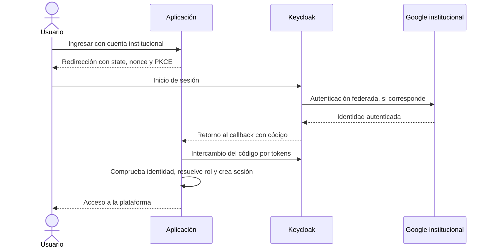

# Integraciones: API, buckets y Keycloak

## Autenticación de la API

La interfaz usa una sesión local emitida por la aplicación después del ingreso. Las integraciones utilizan un token de API creado por un administrador, enviado como `Authorization: Bearer <TOKEN>`. El token se muestra una sola vez; guardarlo en el gestor de secretos del integrador.

Los tokens Bearer de Keycloak no son tokens de API de esta plataforma. La integración OIDC sirve para iniciar sesión en la interfaz. La referencia interactiva de endpoints y parámetros se encuentra en `/docs`; el esquema OpenAPI está en `/openapi.json`.

## Buckets: contrato de entrada y salida

El integrador de SUBTEL debe proporcionar por documento:

| Campo | Uso |
|---|---|
| `source_url` | URL firmada con permiso HTTP GET sobre el original |
| `target_url` | URL firmada con permiso HTTP PUT para la copia protegida |
| `name` | Nombre con extensión admitida; opcional si se puede deducir de la URL |
| `ref` | Referencia del documento en el sistema de SUBTEL |
| `target_headers` | Cabeceras de formato exigidas por la firma, por ejemplo Content-Type |

La aplicación no lista buckets ni genera las firmas. Conserva el original y escribe en el destino indicado. Utilizar un objeto de destino distinto para no sobrescribir el original. Los servicios de lectura/escritura de SUBTEL pueden preparar estos enlaces o adaptar su contrato a GET/PUT.

Ejemplo de cuerpo JSON, con valores ilustrativos:

```json
{
  "options": {
    "document_type": "resolucion",
    "entities": ["NOMBRE", "RUT", "EMAIL"],
    "treatment": "anonymize",
    "analysis_level": "balanced"
  },
  "items": [{
    "source_url": "https://archivos.example.invalid/original.pdf?FIRMA_DE_LECTURA",
    "target_url": "https://archivos.example.invalid/protegido.pdf?FIRMA_DE_ESCRITURA",
    "name": "resolucion.pdf",
    "target_headers": {"Content-Type": "application/pdf"},
    "ref": "expediente-001"
  }]
}
```

Enviar mediante `POST /api/v1/jobs` con `Content-Type: application/json` y token de API. Una respuesta 202 devuelve `job_id`, cantidad de ítems y opciones normalizadas. `GET /api/v1/jobs/{job_id}` entrega resumen, resultados y `finished`; admite filtros `status`, `limit` y `offset`. `DELETE /api/v1/jobs/{job_id}` cancela ítems que todavía no empiezan; los que están procesándose continúan.

Estados de ítem: `queued`, `processing`, `done`, `verification_failed`, `failed`, `cancelled`. El integrador debe consultar periódicamente hasta que `finished` sea verdadero; no se envían callbacks automáticos.

Configurar `BUCKET_ALLOWED_HOSTS` con los nombres de host exactos permitidos. No se siguen redirecciones HTTP. Las URLs deben durar más que la cola y el procesamiento. Las cabeceras deben coincidir con las exigidas por el proveedor al firmar el PUT. Comprobar este contrato con el proveedor real; las pruebas automatizadas usan un servidor HTTP simulado.

Ante `verification_failed`, no se sube una copia. Para revisión humana, cargar el original mediante la ruta interactiva. Ante un error 4xx, generar una nueva solicitud con permisos/firmas vigentes; la API no modifica las URLs de un ítem ya cerrado. Para reintentos de red y reservas vencidas, usar destinos idempotentes como se explica en [Arquitectura](ARQUITECTURA.md).

## Protección directa y revisión humana

`POST /api/v1/redact` recibe un archivo multipart y devuelve la copia en la misma solicitud. Ejemplo con token guardado en el entorno del cliente:

```bash
curl --fail \
  -H "Authorization: Bearer $SUBTEL_API_TOKEN" \
  -F 'file=@documento.txt' \
  -F 'entities=RUT,EMAIL' \
  -F 'treatment=redact' \
  -o documento_protegido.txt \
  https://proteccion.example.invalid/api/v1/redact
```

El flujo con revisión usa `POST /api/v1/documents` para cargar, `GET /api/v1/documents/{id}/findings` para consultar hallazgos y los endpoints de edición, protección y descarga documentados en `/docs`. El perfil Regular utiliza `submit-review` y requiere decisión administrativa. El procesamiento masivo no reproduce esa aprobación humana.

Tratamientos admitidos: `redact`, `anonymize`, `pseudonymize`, `mask_full`, `mask_partial`. Niveles de análisis: `fast`, `balanced`, `exhaustive`. El tipo documental determina la política cuando no se suministra una selección explícita de entidades.

## Keycloak y cuentas institucionales



SUBTEL configura el cliente OIDC con flujo authorization code y PKCE S256; para un cliente confidencial proporciona también `OIDC_CLIENT_SECRET`. Registrar el callback público exacto `/api/auth/oidc/callback` y el retorno de cierre de sesión al dominio de la aplicación.

La aplicación consulta el documento de descubrimiento del realm, intercambia el código directamente con Keycloak y comprueba issuer, audience, nonce y expiración. En este flujo se confía en el canal TLS directo con el endpoint de tokens; no se verifica localmente la firma JWT ni se aceptan tokens OIDC arbitrarios enviados por el navegador. La conectividad y la confianza TLS con Keycloak deben funcionar desde el pod.

Los roles se leen de `resource_access.<client_id>.roles` y `realm_access.roles`. `OIDC_ROLE_MAP` permite traducirlos, por ejemplo:

```json
{"subtel-operacion":"operador","subtel-revision":"revisor","subtel-administracion":"administrador"}
```

Perfiles admitidos: `regular`, `operador`, `revisor`, `aprobador`, `auditor`, `administrador`. Si hay varios perfiles, se elige el de mayor privilegio. Sin un rol reconocido y sin `OIDC_DEFAULT_ROLE`, el ingreso se rechaza. El rol se actualiza en cada inicio de sesión; no se sincronizan sesiones abiertas continuamente.

Las cuentas institucionales de Google se configuran como proveedor de identidad de Keycloak. La plataforma requiere los parámetros de Keycloak y no las credenciales de Google. Las cuentas locales siguen disponibles para la administración inicial.
